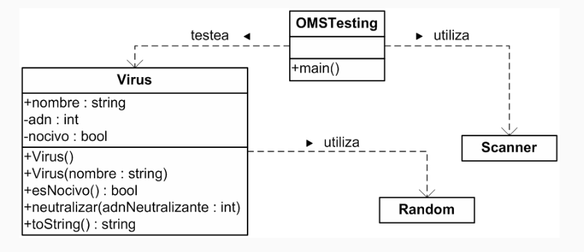

# Virus

Este ejercicio resuelve el siguiente escenario:

La OMS está simulando el comportamiento de un Virus, para ello necesita
controlar los **intentos** necesarios para neutralizarlo.

Para simplificar el ejercicio se sabe que el Virus tiene un valor entero
para su adn. Pero esta información no se conoce, ya que el Virus al crearse
carga este valor aleatoriamente en un rango entre 1 y 10. Neutralizar el
Virus es equivalente a **acertar** este valor. Si el virus no está neutralizado
es nocivo.

Y su diagrama UML es el siguiente:

