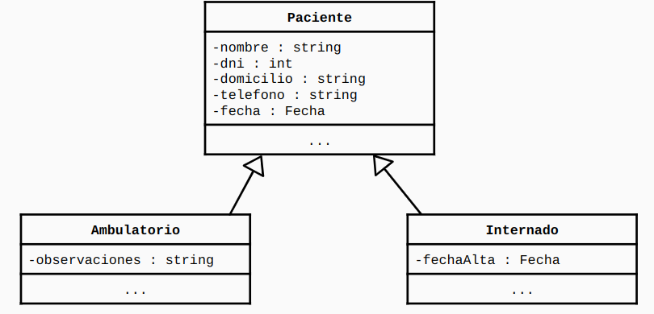

# Clínica

Este proyecto resuelve el siguiente ejercicio:

Para el siguiente caso de estudio implementar en Java una solución orientada a objetos.

Una clínica particular necesita registrar todos los pacientes que ingresan a la
misma. Los pacientes pueden ser clasificados por:

- Ambulatorio: son aquellos pacientes que no se quedan en la clínica (por ejemplo, van
  a ponerse una vacuna). Para llevar un registro se necesita registrar nombre, dni,
  domicilio, teléfono, fecha en la que concurrió al lugar y observaciones.

- Internado: para estos pacientes necesitamos registrar nombre, dni, domicilio, teléfono,
  fecha de ingreso y fecha de alta

