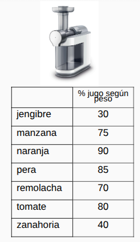
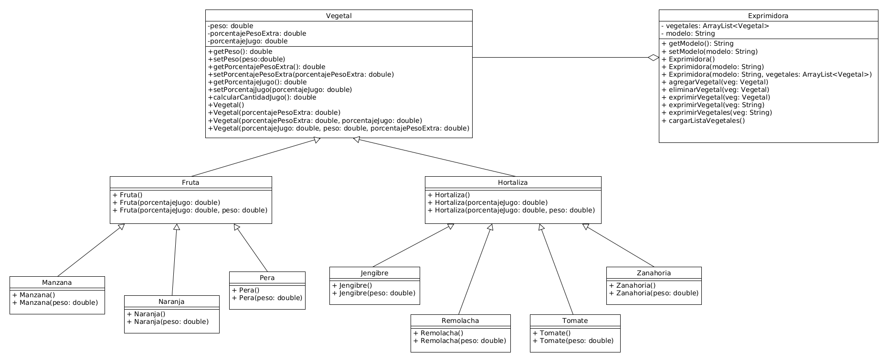

# Exprimidora

Este proyecto busca resolver el siguiente ejercicio:

Se tiene una exprimidora H2025 que puede extraer jugo de frutas y de hortalizas.
Particularmente exprime jengibre, manzana, naranja, pera, remolacha, tomate y
zanahoria. Las frutas tienen un peso extra (semillas y cáscara) del 10% de su
peso, y las hortalizas tienen un peso extra (piel) del 5% de su peso.

Se proporciona la tabla de jugo que da cada uno. Para este ejercicio se considera
que 1gr. = 1ml. y un tomate es una hortaliza.

Implementar el ejercicio en UML y en Java.

Aquí esta mi propuesta del diagrama UML:

