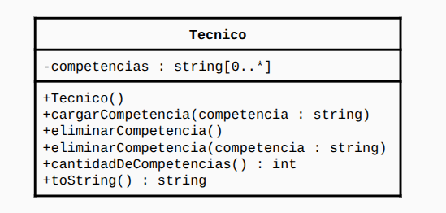

# Director Técnico

En este proyecto se resuelve el siguiente ejercicio:

Realizar una clase sencilla llamada Técnico que tiene como atributo las
competencias de un director técnico. Implemente los siguientes métodos:

En clases se especificó que el metodo eliminarCompetencia() eliminaba
el último elemento del ArrayList.

Luego se pidió lo siguiente:

Modificar la clase para que la cantidad máxima de competencias que pueda
tener un técnico sea de cuatro.
