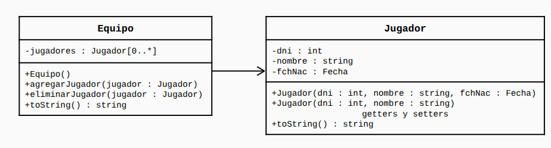
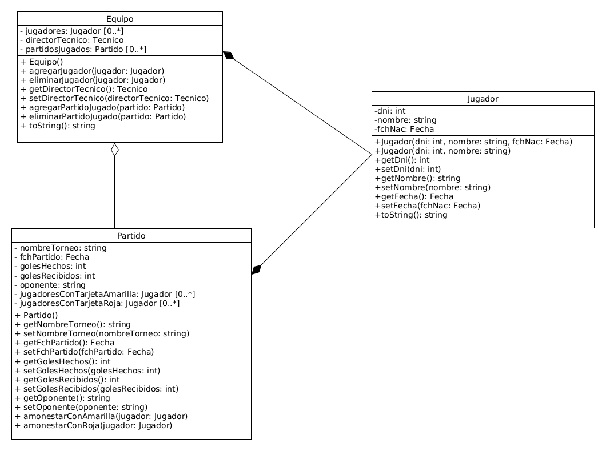

# Fútbol 5

Este proyecto es mi resolución del siguiente ejercicio:

La segunda semana de Junio en el Complejo la loma arranca un campeonato
de fútbol 5 relámpago. Cada equipo cuentan con un total de 10 jugadores que
componen la lista de buena fe. De los jugadores se necesita saber dni, nombre
completo y fecha de nacimiento.

Luego se pidió las siguientes modificaciones para el UML:

- El equipo cuente con un director técnico.
- Se registre información de los partidos.
- En un partido específico se registre la información de las tarjetas amarillas/rojas
  que recibe un jugador. (**Regla polémica**: Las tarjetas no son acumulables para los
  siguientes partidos)

He aquí el UML modificado:

