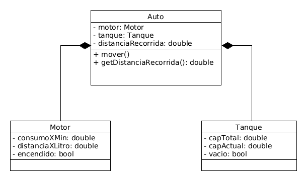

# Auto

Este proyecto es la implementación en Java del siguiente ejercicio:

Dado el diagrama de clases implemente métodos, y constructores necesarios
para que el auto:

- Pueda avanzar un minuto (siempre y cuando tenga nafta).

- Cargar nafta, una cierta cantidad o hasta que el tanque se llene.

- En caso de que el auto se quede sin nafta se apague.

- El método mover() simula el movimiento del auto en un minuto, si puede
  moverse.

