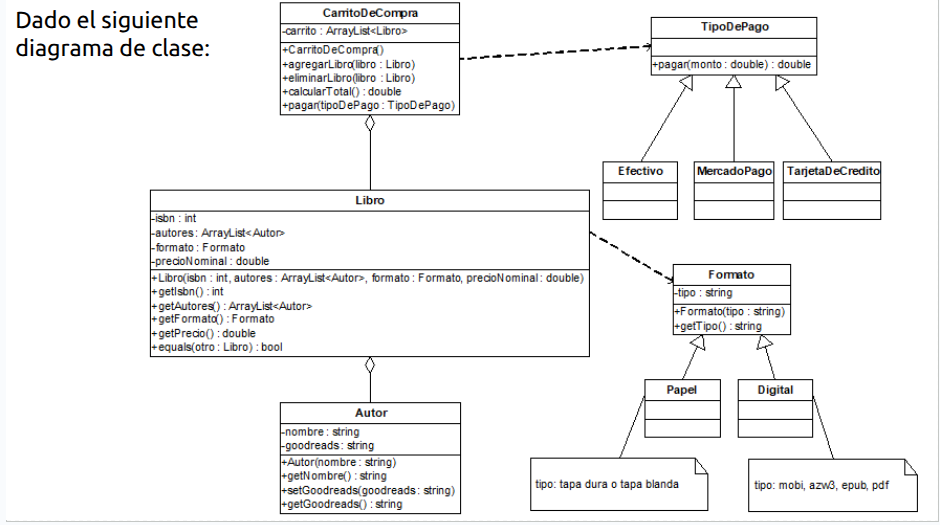
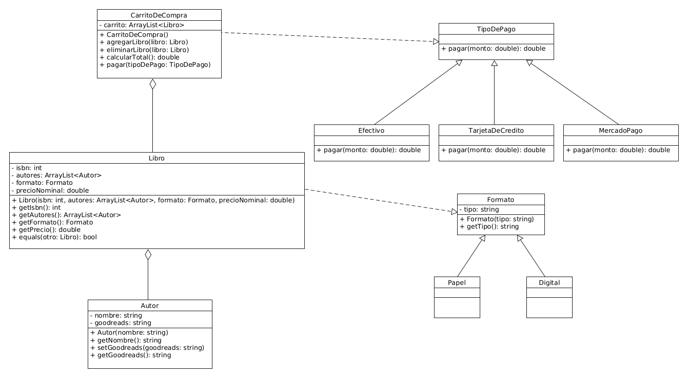

# Carrito de Compra

Este proyecto es la implementación en Java del siguiente ejercicio:

Implementar en Java teniendo en cuenta que:

En la clase Libro:

- equals, dos libros son iguales si tienen el mismo ISBN.

- getPrecio(), el precio de los libros en tapa dura son 20% más que su valor nominal,
  mientras que el precio de los libros en tapa blanda coincide con su valor nominal. El
  precio de los libros digitales es un 15% menos que su valor nominal, salvo el formato
  mobi que vale 5% menos que su valor nominal.

Complete las subclases de TipoDePago, teniendo en cuenta que:

- El pago en Efectivo tiene un descuento del 10% del monto total.

- El pago con MercadoPago tiene un recargo del 15% del monto total.

- El pago con Tarjeta de Crédito tiene un recargo de $100 adicional al monto total.

En la clase CarritoDeCompra

- agregarLibro: agrega un libro al carrito (puede agregar repetidos).

- eliminarLibro: elimina un libro del carrito (si está en el carrito, si hay repetidos sólo
  elimina uno).

- calcularTotal(): calcula el monto total de los libros en el carrito.

- pagar: muestra por pantalla el monto total a pagar, y el monto efectivamente pagado
  dependiendo del tipo de pago.

La modificación del UML en las clases que heredan de TipoDePago solo deben sobrescribir el
método pagar, por lo que el UML queda así:

