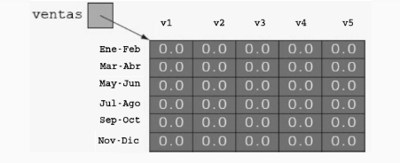

# Ventas

Este proyecto busca resolver el siguiente ejercicio:



Usando ```double[][] ventas```, se quiere:

- v1 realizó una venta por $150 en Junio.

- ¿Cuánto vendió v5?

- ¿Las ventas totales de Marzo-Abril?

- ¿Venta total?
