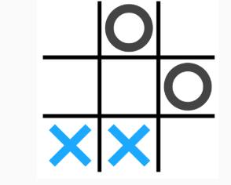

# Tateti

Este proyecto busca resolver el siguiente ejercicio:

Implementar en Java el Juego del Ta-Te-Ti.

Observe que el tablero puede tener tres estados:

- casillero vacío

- casillero con X

- casillero con O

1. Genere los movimientos de la Computadora de forma aleatoria.
2. Mejore la estrategia de la Computadora.

Aquí implementaré el Tateti Mejorado.
