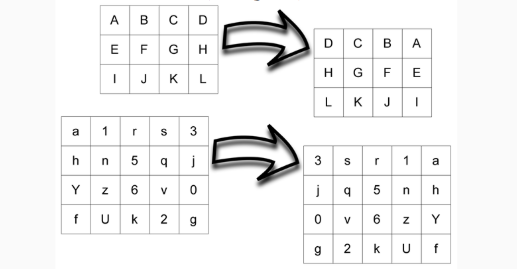

# Maxpooling y Matriz Espejo

Este proyecto contiene la resolucion de los siguientes ejercicios:

## Matriz Espejo

Dada la clase Matriz, escribir una **subclase** un método espejo() que **cambie los elementos de la
matriz**; se busca con este método _simular el reflejo en un espejo_ de los valores contenidos
en la matriz.

Como base, se da la clase Matriz que ya está incluida en el proyecto.

## Matriz Maxpooleada

A cualquier **matriz** se le puede aplicar una operación de maxPooling, mediante una máscara de
tamaño N, si dividimos la matriz en subregiones de tamaño NxN (la cantidad de filas y de
columnas de la matriz original debe ser divisible por N). Para cada sub-región de la matriz
se calcula el valor máximo. Con ellos armamos una nueva matriz con los valores máximos por
región. Por ejemplo, para una máscara de 2x2 tenemos:

Implementar en una subclase, un método que **retorna la matriz maxpooleada** para un tamaño N particular.
