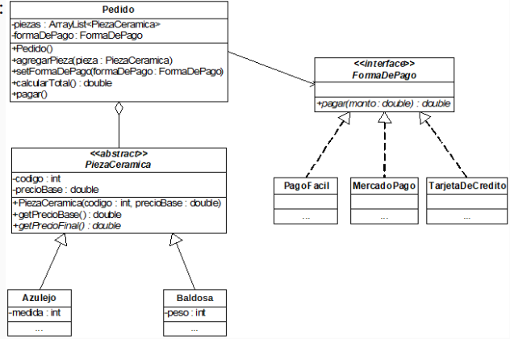

# Corralón

Este proyecto busca, implementando Java, resolver el siguiente problema:

Un famoso corralón online debe gestionar los pedidos de piezas cerámicas de acuerdo al
siguiente diagrama de clases:

Implementar en Java el diagrama de clases, agregando los métodos correspondientes
teniendo en cuenta que:

- El precio final de un azulejo depende de la medida que tenga, sumando al precio base
  $3.05 por cm.
- El precio final de una baldosa depende del peso que tenga, sumando al precio base
  $0.034 por gramo.
- El pago con PagoFacil tiene un recargo del 10% del monto total.
- El pago con MercadoPago tiene un descuento del 7% del monto total.
- El pago con Tarjeta de Crédito tiene un recargo del $240 adicional al monto total.
- Un pedido puede admitir piezas cerámicas con el mismo código.
- Un pedido se puede pagar con cualesquiera de las formas de pago.
- calcularTotal(): calcula el monto final total de las piezas cerámicas en el pedido.
- pagar(): muestra por consola el monto final total del pedido, y el monto
  efectivamente pagado dependiendo de la forma de pago.

En una clase Test hacer lo siguiente:

- Armar un pedido con dos piezas cerámicas:
- Un azulejo con precio base de $500, y 10cm de medida.
- Una baldosa con precio base de $900, y 200gr de peso.
- Elegir como forma de pago Tarjeta de Crédito y pagar.
