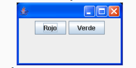
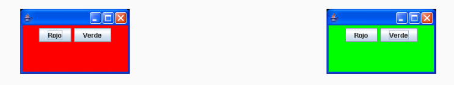
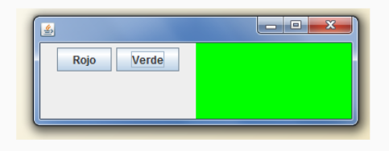

# Botones que cambian el color de fondo

Este proyecto de Java busca resolver el siguiente problema:

Desarrolle una aplicación que permita establecer el color de
fondo de una ventana. El color será rojo o verde de acuerdo al
botón que se apriete.

La ventana inicialmente debe aparecer así:

Este es el aspecto cuando se aprieta rojo o verde:

Luego el ejercicio se modificó de la siguiente forma:

Desarrolle una aplicación que permita establecer el color de un
panel. El color será rojo o verde de acuerdo al botón que se
apriete.

Por ejemplo, cuando se oprima el botón verde la ventana debe
aparecer:

