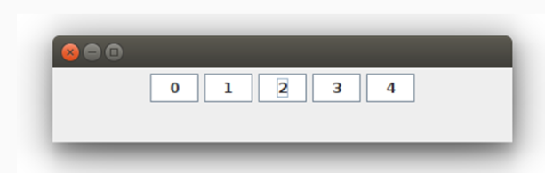

# Botonera

Este proyecto es mi implementación en Java del siguiente ejercicio:

Una GUI brinda cinco botones numerados, inicialmente blancos, cada vez
que se oprime un botón, el color de ese botón pasa a ser rojo y el
texto cambia a OK.

Opción 1:

Si un botón se oprime de nuevo, no se observa ningún cambio, esto es,
permanece rojo.

Hacer:

Si un botón se oprime de nuevo, vuelve al estado original, esto es
fondo blanco y numerado.
