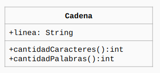

# Cadena

Este es un ejercicio introductorio a Java.
Aquí se nos pidió implementar el siguiente diagrama UML

Donde linea debía valer: "hola chicos de POO 2025" y luego "en casa, pero trabajando".
En mi versión, el contador de palabras excluye a los números (pues no son palabras).
Y, obviamente, el método contador de caracteres cuenta todos los símbolos ASCII.
