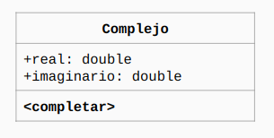

# Complejo

En este ejercicio básico, usamos Java para implementar el siguiente diagrama:

Y había que definir un método para sumar entre números complejos y otro
método en donde se mostraba por consola el número complejo.
