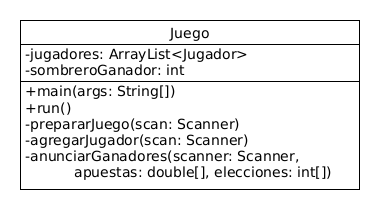

# Juego de la Moneda

El ejercicio es el siguiente:

Cualquier persona que cuente con dinero puede participar como jugador en el Juego.

**Instrucciones del Juego**:

- La mesa cuenta con tres sombreros y una moneda, el dueño de la moneda coloca la
  moneda debajo de un sombrero específico y procede a mover los sombreros unos con
  otros para despistar al jugador

- El jugador elige uno de los sombreros donde supone que está la moneda y pone
  en la mesa la plata que apuesta en esa jugada. Si escoge bien el sombrero, entonces
  gana el doble de lo apostado, mientras que si pierde el dueño se queda con lo
  apostado. El jugador puede retirarse o seguir apostando.

**Realizar el diagrama de clases e implementación de una solución para el problema**

Este es el diagrama que diseñé para este ejercicio:

