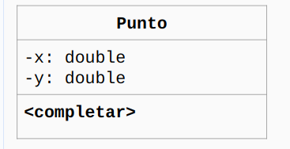

# Punto

Este proyecto resuelve el siguiente ejercicio:

- Implementar en Java la clase Punto.
- Definir e implementar un método que permita medir la distancia Euclídea con respecto a otro punto.
- Definir e implementar un método que permita determinar si un punto cualquiera queda dentro del radio.
